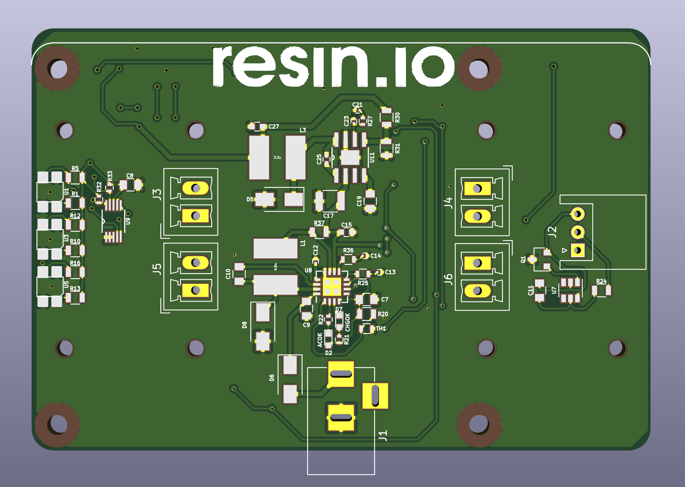
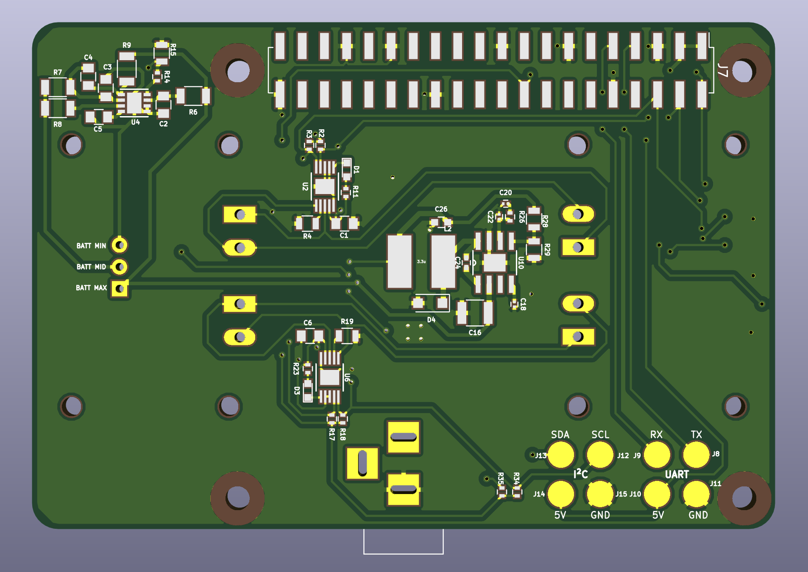

# Resin Rover Wide-HAT

This board is a full-fledged rover in a wide HAT form factor, which mean it covers an entire Raspberry Pi 3.

The motors are driven by two [DRV8830](www.ti.com/product/drv8830) I²C motor controllers, one for the left wheels and the other for the right wheels. The slave I²C address for the left wheels driver are ``0xC0h`` and ``0xC1h``, for write and read respectively. As for the right wheels driver, they are ``0xD0h`` and ``0xD1h``, respectively.

Currently the maximum current for each motor is 500mA.

The line following circuit is made from three reflective sensors, which are read by an [ADC](http://www.ti.com/product/ADS1015) at address ``0x48h``. The left, center and right sensors are read at analog inputs ``AIN0``, ``AIN1`` and ``AIN2`` respectively.

It supports a 2-cell LiPo battery with an on-board charger which should be supplied through a DC barrel jack connector from 9V to 12V, at 1A.

The only manufacturing constrain of this board is that it needs 2oz or higher copper weight.

Besides the components listed on the BoM, the rest of the parts needed are:

* 4 x Micro Metal Gearmotor ([example](https://shop.pimoroni.com/products/micro-metal-gearmotor-extended-back-shaft))
* 4 x Micro Metal Gearmotor Bracket ([example](https://shop.pimoroni.com/products/pimoroni-gearmotor-bracket-pair))
* 4 x Wheels ([example](https://shop.pimoroni.com/products/pololu-wheel-32x7mm-pair))
* 1 x 2-cell LiPo battery with JST-XH connector ([example](https://hobbyking.com/en_us/turnigy-5000mah-2s-20c-lipo-pack.html))

Raspberry Pi mounting holes were taken from [here](https://github.com/xesscorp/RPi_Hat.pretty/blob/master/RPi_Hat_Mounting_Hole.kicad_mod) and inductor footprint from [here](https://github.com/Tinkerforge/kicad-libraries/blob/master/SRN6045.kicad_mod).
